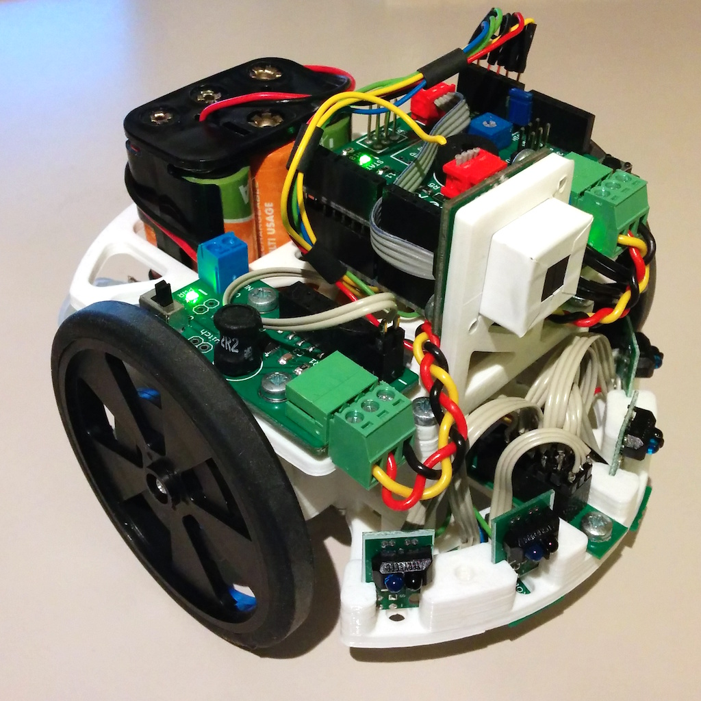
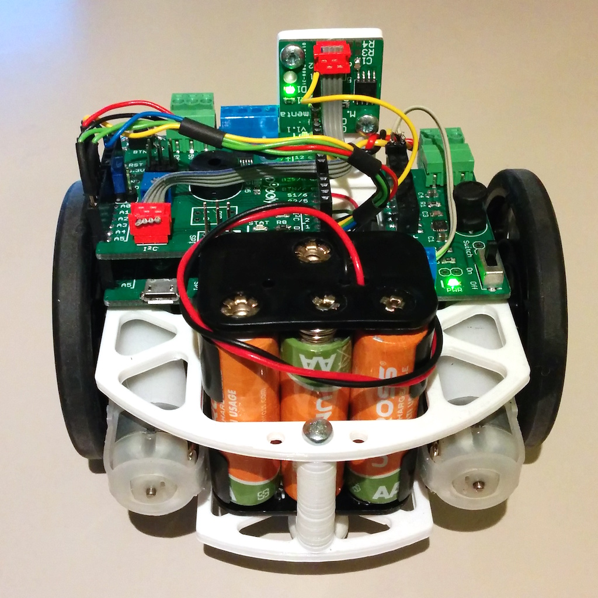
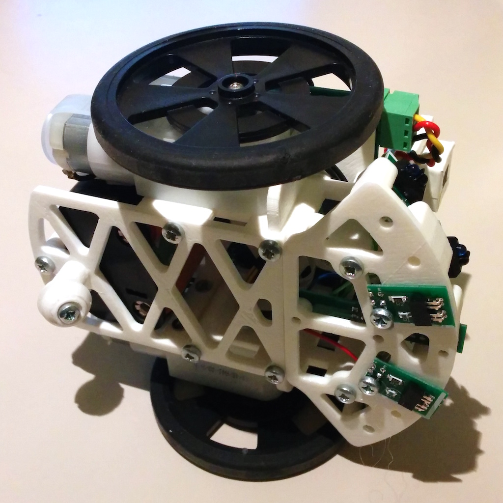

# Robopoly demonstration robot 3D printed base

The Robopoly demonstration robot is intended to serve as a modular base for demonstrations during [Robopoly lectures](http://robopoly.epfl.ch/demons) to show off the robotics platform capabilities. It is modular, all important parts are accessible, has a small footprint and is made only using electronics from the [kit PRisme](http://robopoly.epfl.ch/prisme).

## Design

Since the parts are intended to be printed with a 3D printer with fused filament fabrication (FFF) method they are small and full of holes in order to avoid warp because of uneven material cooling on 3D printers lacking a heated bed and using excessive amounts of material.

The front of the robot can accomodate different modules depending on the task at hand. 4 holes for M3 screws can be used to attach a custom add-on.

The center of the platform is empty, that space can be used to route electrical wires from the front of the robot to the [PRismino](https://github.com/Robopoly/PRismino) or store some additional electronics.

The USB port is easely accessible for programming and all the electronics are on top of the robot allowing easy access.

Horizontal holes in the supports are square because when printing big horizontal round holes with FFF method the plastic tends to warp upwards when the hole is being closed at the top because of unequal cooling, this basically creates an obstacle for the extruder which is to be avoided at all costs, square holes do not warp.

## Parts list

| Part                                                                | Quantity |
| ------------------------------------------------------------------- | -------- |
| Base                                                                |        1 |
| Top                                                                 |        1 |
| Support left                                                        |        1 |
| Support right                                                       |        1 |
| Support rear                                                        |        1 |
| Caster roller                                                       |        1 |
| Caster wheel                                                        |        1 |
| Front                                                               |        1 |
| Linear camera support                                               |        1 |
| M3x8 countersunk head screw for motors                              |        4 |
| M3x5 pan head screw for rear support                                |        2 |
| M3x8 pan head screw for electronics, rear support and caster roller |        5 |
| M3x10 countersunk head screw for caster wheel                       |        1 |
| M3x10 pan head screw for the frame                                  |       10 |
| M3 washer for caster roller                                         |        1 |

When assembling start with the motors as the holes won't be accessible with a screwdriver later on.

## Robopoly Control Center

The plaform is suited to be used with [Robopoly Control Center](https://github.com/Robopoly/RobopolyControlCenter), a [Google Chrome add-on](https://chrome.google.com/webstore/detail/robopoly-control-center/kimabfnmacaikklmibbbomomjffkfalo) that can remotely control the mobile platform, make it do some tasks and report pin values over USB or Bluetooth.

## Licence

The Robopoly demonstration robot printed base is published under [Creative Commons Attribution license](http://creativecommons.org/licenses/by/3.0/).

